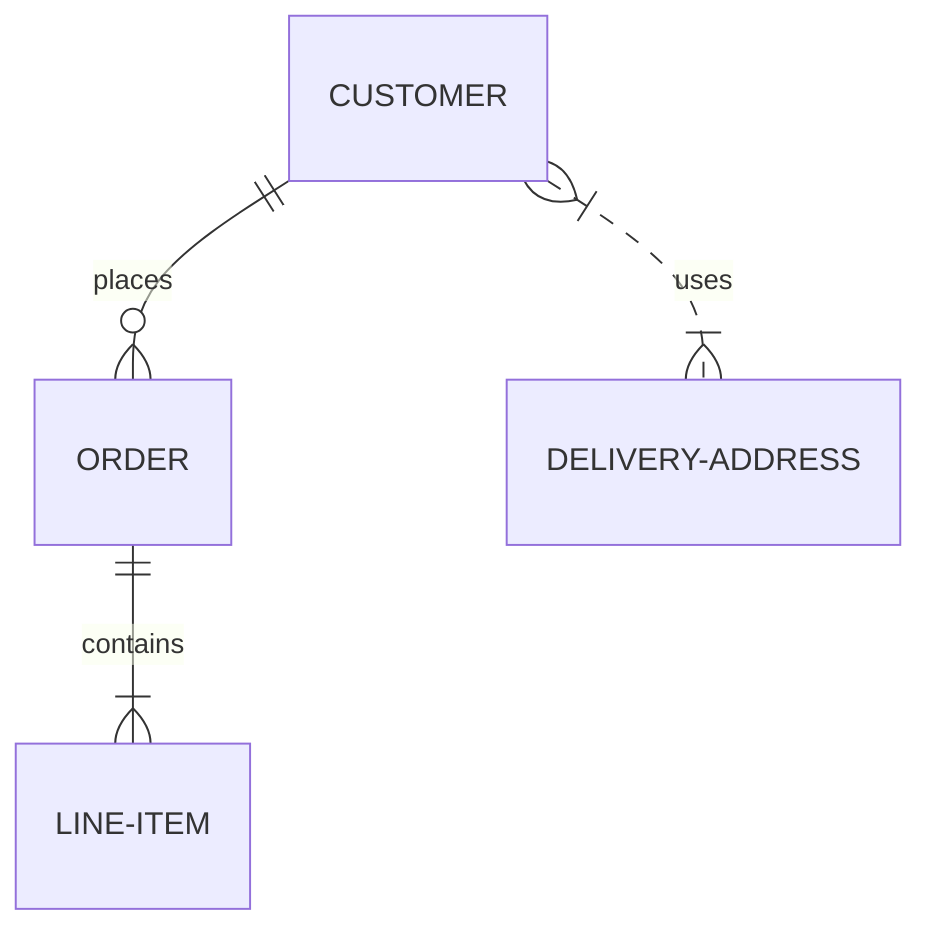
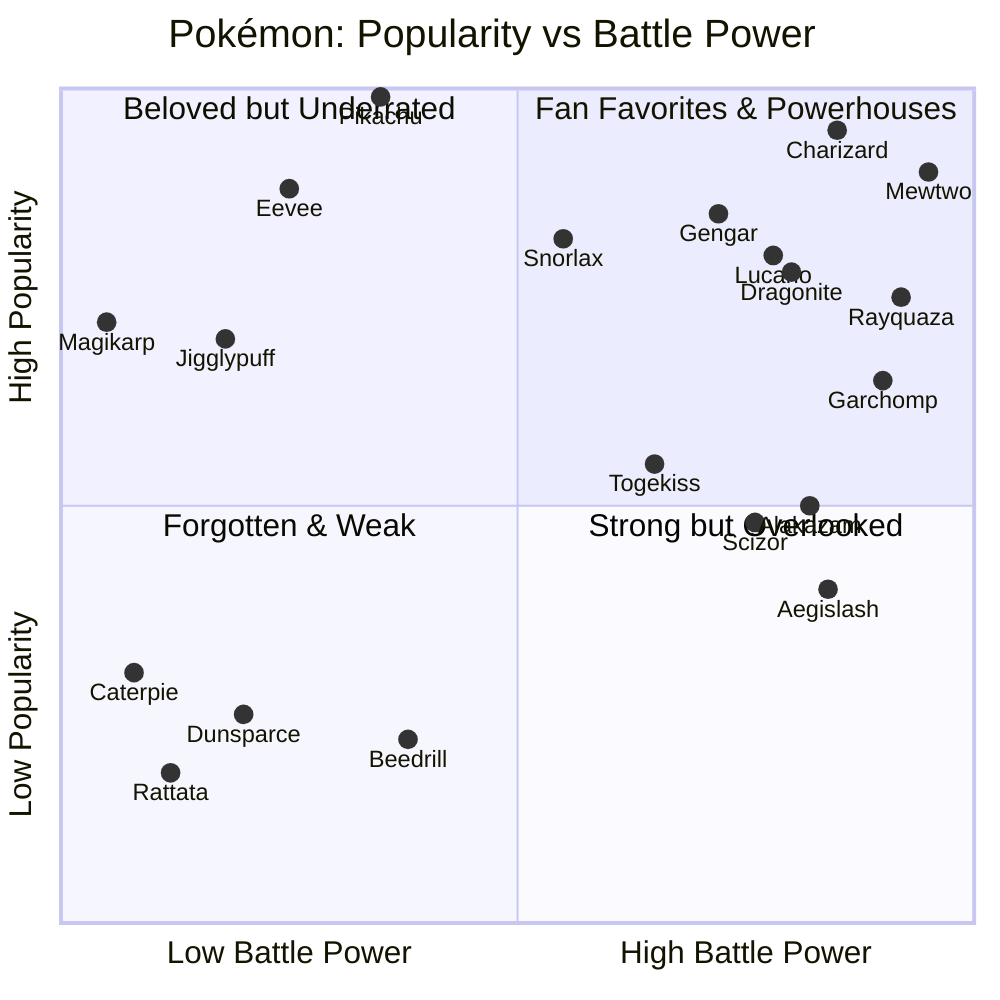

[](https://github.com/nishman89/Data601/actions/workflows/python-package.yml)

# H1 Headings

## H2 Headings

### H3 Headings

###### H6 Headings

## Stylings 

*This is italics*

_This is also italics_

__This is bold__

**This is also bold**

## Comments

> NOTES
>
> Remember to add this to the document
>
> > And also pick up some granola on the way
> > > Though check protein content

## Lists 

- this
- that 
- the other

* first
* second 
* third

<br>

1. One
1. Two
1. Three
   - 3

## Links


### Pictures
<!-- 


 -->


### External links

This is my [markdown cheatsheet](https://enterprise.github.com/downloads/en/markdown-cheatsheet.pdf)


### Link to document headers

- [h2 headings](#h2-headings)
- [Links](#links)
- [Lists](#lists)

## GitHub Flavored Markdown

```csharp
public static Main()
{
    Console.WriteLine("Hello, World!");
}
```

```python
list1 = [1,2,3,4]
```

```sql
SELECT * FROM Customers
```


## Tasks Lists

- [ ] This is a tasks
- [X] This is a completed task 

Name | Street | Town
-----|--------|-----
Nish|Python St| Oxford
Nash|C# St| Brum


## Mermaid





